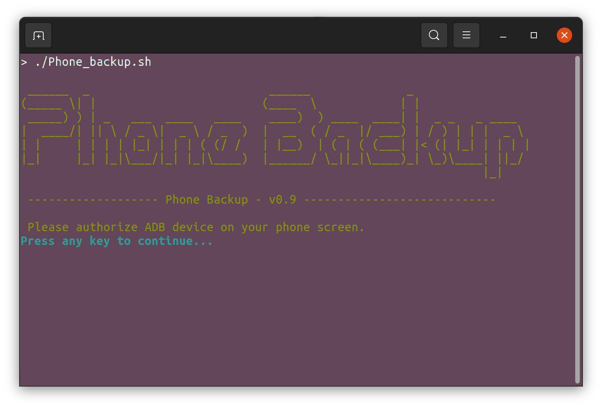

# Phone backup

<center>Backup and Restore your android phone.</center>

## DESCRIPTION
Phone Backup a tool designed to backup and restore data between your android phone and a personal computer (linux).
This is far from perfect and it have been written for my personal needs. 

### Limitations 
- The `developer's options` and `ADB` (with root) on the phone need to be activated.
- It should only work with testing ROM (`eng` or `userdebug`), [see here][adb_root].
- It have been only tested on LineageOS 18.1 but other version of LineageOS or other AOSP based ROM should be working fine.

There is also some limitations due to android and `adb backup` and some data apps can't be saved (see OTHER LIMITATIONS below).

## INSTALL
Just copy all files in a folder inside your `$HOME` and make sure all scripts *.sh are executable:
```
chmod -R +x *.sh
```

## USAGE
### Run BACKUP
#### Command
Open a terminal, execute the backup script and follow the instructions: 
```
./Phone_backup.sh
```

#### Options

- __`-h|--help`__: list options.
- __`-v|--version`__: show version.
- __`-nc|--no-color`__: no output color.
- __`-lm|--list-music`__: export music files list in .txt file instead of making a full backup of music directory. This can be useful if you're using a third party apps to sync your music and/or if you want to skip music files.

### Restore BACKUP
#### command
Open a terminal, execute the restore script and follow the instructions: 
```
./Phone_restore.sh
```

The script will list all the backups available and make you choose the one you want.

#### Options

Basic: same as phone_backup.sh (see above).

#### options
- __`-h|--help`__: list options.
- __`-v|--version`__: show version.
- __`-nc|--no-color`__: no output color.
- __`-l|--latest `__: use the latest backup available, list ofno choice will be prompted.
- __`-ns|--no-system-apps`__: Force to skip system apps data. 
- __`-fs|--force-system-apps`__: force to use the android archive which included the system apps data.

__Note__: By default, system apps data are restored if you are using the same device as the backup source.

## PROCESS DESCRIPTION
### Backup
For every backup, the script will create a folder with date and device name. You will need to accept adb certificats on the device to start. Then, some specific android files and databases will be copied to the backup folder, as personal files, music, documents and pictures. Then `adb backup` will saved data apps. 

The script will save:
- __Contacts__: The contacts databases are copied and extracted to produce VCARD files (v3 & V4) that can also be used for manual import.

- __Phone logs__

- __SMS/MMS history__

- __Photos__: Photos will be saved in a separate folder in a  incremental(ish) mode. It will always mirror the latest state of photos stored, but for previous saved files that are deleted, the backup process will move deleted files in a separate subfolder named with date.

- __Music__: copy music files from main android music folder. It can also just export a list of music instead with option `--no-music` so it could save storage space if you don't need to backup your music files, in case for example you're using a third solution to sync your music (see options below). 

- __Files: Documents and Download__

- __Apps__: APK and data apps are saved separately. It will also do some special tricks (save extra backup files for Signal app, Chrome/Firefox bookmarks and extract custom data from other apps I personalty used). Data apps are stored in android archives with `adb backup` command and it is mandatory to choose a password on the phone screen during the process, then it will be asked to enter the same password on your PC terminal. This data will be saved in two archives, one with system apps included and without.

- __Brownser Bookmarks__: *only Chrome/Firefox, **need to be restored manually. 

- __Ringtone and Notification__

__Note__: I assumed that PC storage is secure (encrypted) as these scripts will copy and store partly no encrypted phone data.

 ### Restoration
The script will list all previous backup and ask you to choose the one you want to restore. You can use `--latest` to force the latest and bypass this step (see USAGE).

Depends of the situation, system apps will be automatically restored if your using the same device. You can choose to not restore system apps data with `--no-system-apps` option (see USAGE). You should also not use system apps data if you restoring from a different version of android.

## PREREQUISITE 

### Packages
Some packages need to be installed:
- __ADB tools__
- __base64__ (coreutils)
- __java__
- __sqlite__: (use to read android databases).
- __perl__

#### Install
Debian/Ubuntu
```
sudo apt install adb android-tools-adb coreutils sqlite3 libsqlite3-dev perl default-jre
```

Fedora
```
sudo dnf install android-tools coreutils sqlite perl-core openjdk
```

### Extra binaries
- __`Android Backup Extractor`__ ([source][abe_source]) is used to unpack encrypted android archives generated by `adb tools`. This binary is executed to check the password chosen by the user for the android archives and store it for a future restore.
- __`AAPT2`__: Android Asset Packaging Tool ([source][docs_aapt2]).

These dependencies will be automatically downloaded in the source folder at first run, but you can also download the binary [here][abe_download] and [here][source_aapt2]. Then, copy it in the `ressources` folder. 

## OTHER LIMITATIONS

### android version
This script is fully tested with LineageOS 18.1 ([Website][lineageos]). It should also work fine with previous version or any AOSP based ROM (Some path may need to be modified in `source.sh` file). 

### Windows
Windows do not provide native BASH support, but it should be possible to make it work with WLS (Windows Subsystem for Linux).

### adb backup now / android 12
This script used `adb backup` to proceed and some apps won't allow backup (example: Chrome, Firefox,...). In result, these apps data can't be saved thought this command. 

In addition, Android 12 will not longer allow any apps data to be saved with `adb backup`. This tools may also be removed from Android in a near future as Google seems considering these data more secure in there servers than our personal system storage ([source][android12_adb]).

Despite this, my script mainly use `adb pull` command to copy files and directories so in the future it would still be possible to backup main data (SMS/MMS, contacts, Photos,...). 


## EXTRA CONFIGURATION
It's possible to override some default settings in `backup.conf`.  Just rename `backup.conf.default` to `backup.conf` if you want to use it.

```
# ---- Backup subfolders names ---- #
#FOLDER_CONTACTS_NAME=""
#FOLDER_MMS_SMS_NAME=""
#FOLDER_APP_NAME=""
#FOLDER_PHOTOS_NAME=""
#FOLDER_MUSIC_NAME=""
#FOLDER_FILES_NAME=""
#FOLDER_BOOKMARKS_NAME=""
#FOLDER_RINGTONES_NAME=""

# ---- Backup folder ---- #
# default: /home/$USER/Phone/BACKUP
#PATH_BACKUP_FOLDER=""

# ---- Backup option ---- #

# List music files instead of copied them
#list_music=true

# ---- Restore options ---- #

# Use latest backup available (skip list all backups)
#latest=true

# Force to restore non system data apps
#no_system_apps=true

# Force to restore system data apps
#force_system_apps=true

```
## NOTE

On Lineage 18.1, there is also a native solution called __SeedVault__ to backup data on an external storage, SD card or on Nextcloud server ([Website][seedvault]).


[android12_adb]: https://developer.android.com/about/versions/12/behavior-changes-12#adb-backup-restrictions (official from dev.android.com)
[lineageos]: https://lineageos.org/ (Lineageos Official)
[seedvault]: https://github.com/seedvault-app/seedvault (Seedvault Official Github)
[abe_source]: https://github.com/nelenkov/android-backup-extractor (Abe Github source)
[abe_download]: https://github.com/nelenkov/android-backup-extractor/releases (Abe download)
[docs_aapt2]: https://developer.android.com/studio/command-line/aapt2 (AAPT2 docs)
[source_aapt2]: https://maven.google.com/web/index.html (AAPT2 source)
[adb_root]: https://android.stackexchange.com/questions/213116/why-adb-root-does-nothing/213429#213429 (details)